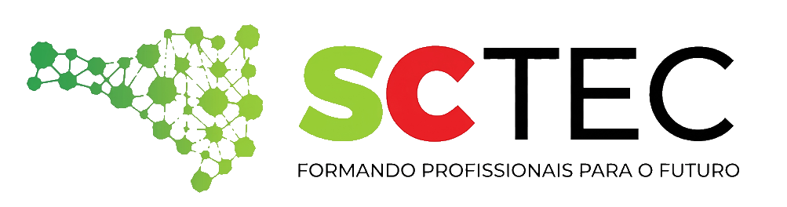

<p align="center">
  <picture>
    <source media="(prefers-color-scheme: dark)" srcset="img/logo_sctecB.png">
    <source media="(prefers-color-scheme: light)" srcset="img/logo_sctecW.png">
    
  </picture>
</p>

# 🧠 MNIST - Pipeline de treinamento, comparação,  inferência e visualização 3D.

Este projeto tem como objetivo treinar, comparar e utilizar modelos para classificação de dígitos manuscritos do conjunto MNIST. A solução inclui três abordagens principais:

- Random Forest
- SVM com kernel RBF
- CNN (Rede Neural Convolucional)

Além disso, o projeto também realiza:

- análise exploratória do dataset
- visualização do balanceamento das classes
- comparação de métricas entre modelos
- geração de matrizes de confusão
- teste de out-of-distribution (OOD)
- aplicação desktop para inferência em imagens
- visualização 3D da CNN

---

## 📌 Visão geral

O fluxo principal é executado em [main.py](main.py). Ele carrega o dataset MNIST, aplica o processamento correspondente à versão escolhida, treina os modelos, compara os resultados e salva os artefatos gerados em pastas separadas por versão.

A aplicação de inferência está em [app.py](app.py). Ela permite carregar uma imagem de um, ou mais, dígito(s) e usar um modelo treinado para realizar a predição diretamente.

A visulaização 3D está em [app3D.py](app3D.py). Ela permite carregar o modelo treinado para visualizar as camads que compõe CNN.

---

## 📁 Estrutura do projeto

```text
.
├── main.py
├── app.py
├── app3D.py
├── README.md
├── images/
│   ├── V1/
│   ├── V2/
│   └── V3/
├── models/
│   ├── V1/
│   ├── V2/
│   └── V3/
│       ├── cnn_mnist.keras
│       ├── metadata.json
│       ├── random_forest_mnist.joblib
│       └── svm_mnist.joblib
├── src/
│   ├── install.py
│   ├── pipeline.py
│   ├── modeloexemplo.py
│   ├── visualizador.py
│   └── testOOD.py
└── img/
```

Os resultados de treinamento e gráficos são armazenados em:

- `images/<V1|V2|V3>/` para visualizações e comparações
- `models/<V1|V2|V3>/` para modelos treinados e metadados

---

## ⚙️ Requisitos

O projeto usa bibliotecas como:

- Python 3.10+
- NumPy
- Pandas
- Matplotlib
- Seaborn
- scikit-learn
- OpenCV
- TensorFlow
- PySide6
- joblib
- console
- random
- json
- Pillow
- keras
- webbrowser
- http.server
- socketserver

A instalação das dependências é feita automaticamente pelo script [src/install.py](src/install.py), quando o projeto é executado.

---

## 🚀 Como executar o treinamento

No diretório raiz do projeto, execute um dos comandos abaixo:

### Versão V1 - pipeline base

```bash
python main.py V1
```

### Versão V2 - traços mais finos

```bash
python main.py V2
```

### Versão V3 - traços mais robustos

```bash
python main.py V3
```

Durante a execução, o programa:

1. carrega o conjunto MNIST
2. exibe amostras e balanceamento das classes
3. separa treino e teste
4. aplica o processamento específico da versão escolhida
5. treina os 3 modelos
6. salva gráficos e métricas
7. gera arquivos em `models/` e `images/`

---

## 🏋️ Versões do pipeline

### V1 - Pipeline base
A versão V1 mantém o processamento padrão do MNIST.

Características:

- entradas 28x28
- normalização por 255
- treinamento sem perturbações adicionais

---

### V2 - Traços finos
A versão V2 aplica erosão sobre as imagens para simular traços mais delicados.

Processamento usado:

- erosão com OpenCV
- geração de imagens adicionais
- concatenação com os dados originais
- treinamento com dados expandidos, **dataset duplicado**

Essa versão costuma ser útil para cenários em que a escrita é mais sutil ou mais fina.

---

### V3 - Traços robustos (grosso)
A versão V3 aplica:

- dilatação para engrossar os traços
- blur gaussiano para suavizar bordas
- geração de imagens reforçadas para treinamento, **dataset duplicado**

Essa configuração é indicada para imagens com traços mais grossos, menos definidos ou com ruído visual.

---

## 🧪 Modelos treinados

Em cada versão, o projeto treina os seguintes modelos:

### Random Forest
- entra com dados vetorizados em 784 pixels
- salvo em:
  - `models/V1/random_forest_mnist.joblib`
  - `models/V2/random_forest_mnist.joblib`
  - `models/V3/random_forest_mnist.joblib`

### SVM (RBF)
- usa kernel RBF
- também treinado sobre os vetores 784 pixels
- salvo em:
  - `models/V1/svm_mnist.joblib`
  - `models/V2/svm_mnist.joblib`
  - `models/V3/svm_mnist.joblib`

### CNN
- rede convolucional com entrada 28x28x1
- salvo em:
  - `models/V1/cnn_mnist.keras`
  - `models/V2/cnn_mnist.keras`
  - `models/V3/cnn_mnist.keras`

---

## 📊 Saídas geradas

Ao rodar o treinamento, o projeto gera:

- gráficos de distribuição das classes em `images/<versao>/`
- exemplos visuais dos dados e do processamento em `images/<versao>/`
- matrizes de confusão comparativas entre modelos
- arquivo `metadata.json` em cada pasta de modelo com métricas e informações do treino

Exemplo de estrutura de saída:

```text
models/
└── V3/
    ├── cnn_mnist.keras
    ├── random_forest_mnist.joblib
    ├── svm_mnist.joblib
    └── metadata.json
```

---

## 🖥️ Como usar a aplicação desktop

A aplicação [app.py](app.py) permite testar inferência em uma imagem específica selecionada pelo usuário.

### Exemplos de uso

#### CNN da versão V3

```bash
python app.py --CNN:V3
```

#### Random Forest da versão V2

```bash
python app.py --RF:V2
```

#### SVM da versão V1

```bash
python app.py --SVM:V1
```

### Estrutura dos argumentos

```text
--<TIPO_DE_MODELO>:<VERSAO>
```

- `--CNN` = CNN
- `--SVM` = SVM
- `--RF` = Random Forest
- `V1`, `V2`, `V3` = versão do pipeline

Exemplos válidos:

```bash
python app.py --CNN:V1
python app.py --RF:V2
python app.py --SVM:V3
```

A interface carrega automaticamente o modelo correspondente ao argumento informado e realiza pré-processamento da imagem antes da predição.

---

## 🖥️ Como usar o visualizador 3D

A aplicação [app3D.py](app3D.py) permite visualizar as canadas da rede CNN de forma 3D e interativa.

### Exemplos de uso

```bash
python app3D.py V2
```

---

## 🔬 Observações de uso

- O projeto usa o dataset MNIST obtido via OpenML.
- O treinamento pode levar alguns minutos dependendo do ambiente e do hardware disponível.
- Modelos treinados já existentes podem ser reutilizados pela aplicação sem a necessidade de rodar todo o pipeline novamente.
- Os experimentos ficam organizados por pasta de versão para facilitar comparação entre V1, V2 e V3.

---

## ✅ Resumo

Este projeto funciona como uma pipeline completa de experimentação com MNIST, permitindo:

- comparar abordagens tradicionais e profundas
- avaliar o impacto de diferentes pré-processamentos
- salvar modelos treinados para uso posterior
- testar inferência em imagens reais por meio de uma interface gráfica

---

## 📦 Dependências

O projeto verifica e instala automaticamente as bibliotecas necessárias em [src/install.py](src/install.py), incluindo:

 NumPy
- Pandas
- Matplotlib
- Seaborn
- scikit-learn
- OpenCV
- TensorFlow
- PySide6
- joblib
- console
- random
- json
- Pillow
- keras
- webbrowser
- http.server
- socketserver

Se quiser rodar manualmente a verificação:

```bash
python -c "from src.install import verificar_e_instalar_bibliotecas; verificar_e_instalar_bibliotecas()"
```

---

## 📤 Saídas geradas

### 🖼️ Pastas de imagens
As imagens processadas e os gráficos ficam em:

- `images/V1/`
- `images/V2/`
- `images/V3/`

Exemplos de arquivos:

- `balanceamento_classes.png`
- `grade_exemplos*.png`
- `comparativo_processamento.png`
- `fase4_matrizes_confusao_comparativas.png`
- `resultado_teste_ood.png`

### 🧩 Pastas de modelos
Os modelos treinados ficam em:

- `models/V1/`
- `models/V2/`
- `models/V3/`

Exemplos de arquivos:

- `random_forest_mnist.joblib`
- `svm_mnist.joblib`
- `cnn_mnist.keras`
- `metadata.json`

---

## 💡 Dicas de uso

- Para a forma mais simples e rápida, use `V1`.
- Para melhorar robustez em traços mais finos, use `V2`.
- Para imagens com escrita mais grossa ou mais intensa, use `V3`.
- Para avaliar o melhor modelo, teste as três versões e compare as métricas salvas em `metadata.json`.

---

## ⚠️ Observações importantes

- O treinamento de CNN e dos modelos mais pesados pode levar algum tempo, principalmente no download do dataset e no ajuste dos modelos.
- O projeto salva os artefatos em pastas específicas por versão, o que facilita comparar desempenho entre `V1`, `V2` e `V3`.
- O teste OOD está presente para avaliar comportamento do modelo em instâncias fora do conjunto de treinamento padrão.

---

## ✅ Resumo rápido

```bash
# Treinar versão base
python main.py V1

# Treinar versão com traços finos
python main.py V2

# Treinar versão com traços robustos
python main.py V3

# Usar modelo treinado na aplicação desktop
python app.py --CNN:V3
python app.py --SVM:V1
python app.py --RF:V2

# Usar modelo treinado para visualização 3D
python app3D.py V1
python app3D.py V2
python app3D.py V3
```

Mafra, 10 de Setembro de 2026.